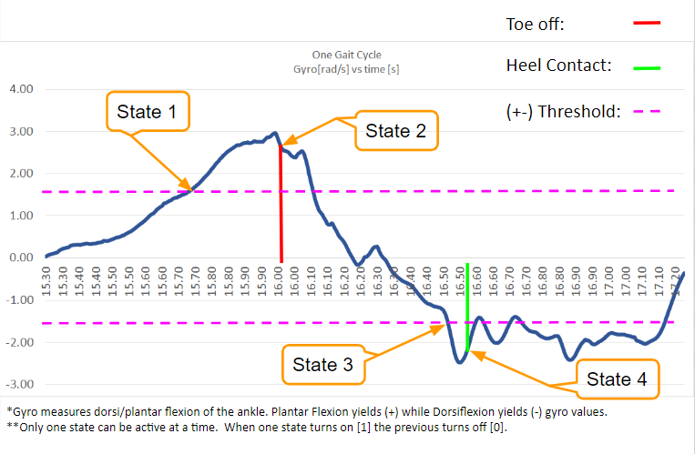

# RehabTechnology

------------

### About The Project

This project was the design and implementation of the Gait Detection Algorithm for the soft exoskeleton TrueStep, designed in Rehabilitation Engineering's course by Dr. Jose Luis Contreras-Vidal. This class was conducted in the University of Houston's College of Engineering, Spring 2020.

------------
### About Team Members

- **Faculty Mentor:** Jose L Contreras-Vidal, PhD - jlcontreras-vidal@uh.edu
- **Team Lead:** Nima Eskandari - nima.eskandari@outlook.com
- **Team Engineers:**
	- **GUI Engineer:** Branco, Luciano - lfbranco@uh.edu 
	- **Standards and Testing Engineer:** Abu, Adham Osama - aoabushanab@uh.edu
	- **Exo Interface Engineer:** Gokhale, Sanjana - ssgokhale@uh.edu
	- **Sensors System Engineer:** Gonzalez-Espana, Jose - jgonzalezespana@uh.edu
	- **Gait Engineer:** Tomer, Travis - tmtomer@uh.edu **(*)**

**(*)** Author of this repository and code.

------------

### About The Repository

The algorithm was implemented using Python 3.8.2.  It utilizes a custom Circular Buffer Class to relatively analyze real-time data of the patients gait cycle. A graphical overview of how the algorithm works is in the following section.

The algorithm was designed to be used to analyze the Gyroscope data [rad/s] of the Plantar/Dorsiflexion of the patients ankle.  The sensor should be placed to where Plantar Flexion yields positive gyroscopic values and Dorsiflexion yields negative gyroscopic values.  The sensor was placed on the top of the foot directly above the Metatarsel and the orientation of the sensor is critical for the algorithm to function properly. If reversed the code will detect toe off events when heel contacts happen and vice versa.  

Only one sensor is needed for the algortihm to detect the state of the patients gait cycle. Although future users of the project could use more data types/axis or more sensors to achieve better accuracy.  

**This is a first iteration design.  It was developed during the Covid-19 gloabal pandemic and was not tested on real-time data nor was it tested on patients with gait disabilities.  It was only tested using personally collected data of my own healthy gait cycle. **

------------

### Graphical overview of the algorithm

